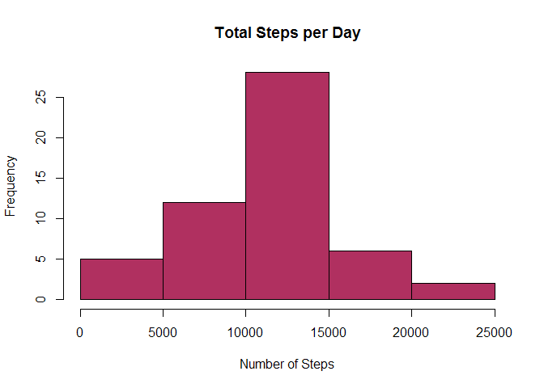
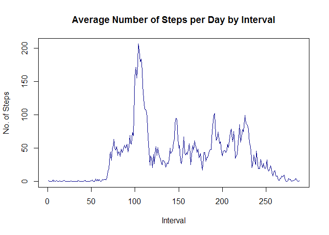
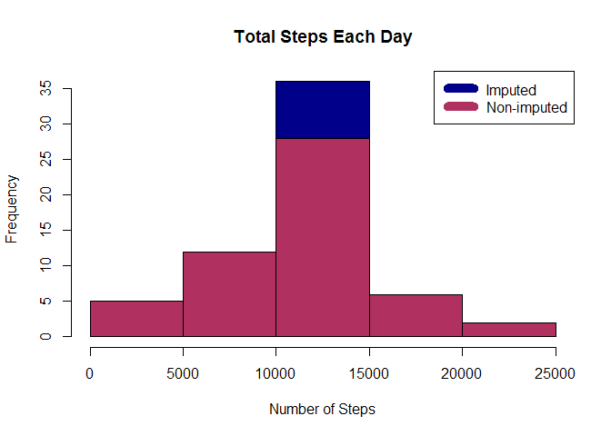
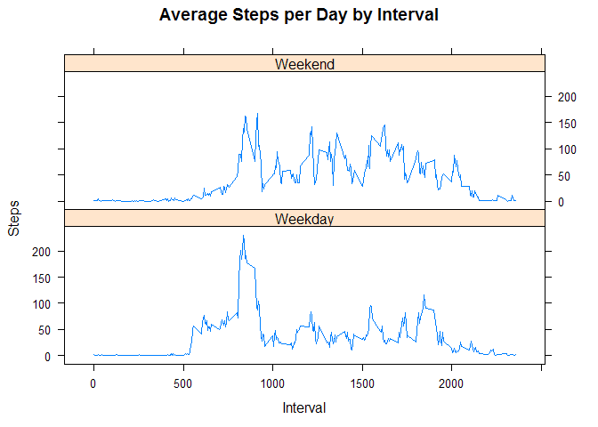

# Analysing Fitbit Activity Data
Mudit Sharma  
September 5, 2016  

##Loading and Processing Data to need..
Download, unzip and load data into dataframe `act`.


```r
act<- read.csv("activity.csv",sep = ',',header = TRUE)
act$date<-as.Date.factor(act$date)
```

##Mean and Median of total number of steps taken per day..
Sum steps by day, create Histogram, and calculate mean and median.

```r
steps_date <- aggregate(steps ~ date, act, sum)
hist(steps_date$steps, col = 'maroon',xlab ="Number of Steps",main = "Total Steps per Day")
```

<!-- -->

```r
rmean <-mean(steps_date$steps)
rmedian<-median(steps_date$steps)
```
## Average daily activity pattern..

* Calculate average steps for each interval for all days. 
* Plot the Average Number Steps per Day by Interval. 
* Find interval with most average steps.

```r
steps_interval<- aggregate(steps~interval,act,mean)
plot(steps_interval$steps,type = 'l',xlab = "Interval", ylab = 'No. of Steps', main = "Average Number of Steps per Day by Interval",col="darkblue")
```

<!-- -->

```r
steps_interval[which.max(steps_interval$steps),]
```

```
##     interval    steps
## 104      835 206.1698
```
## Impute missing values. Compare imputed to non-imputed data.
Missing data needed to be imputed. Only a simple imputation approach was required for this assignment. 
Missing values were imputed by inserting the average for each interval.

```r
sum(!complete.cases(act))
```

```
## [1] 2304
```

```r
act_clean <- transform(act, steps = ifelse(is.na(act$steps),   steps_interval$steps[match(act$interval,steps_interval$interval)], act$steps))
```
Recount total steps by day and create Histogram.

```r
steps_date_clean <- aggregate(steps ~ date, act_clean, sum)
hist(steps_date_clean$steps, main = "Total Steps Each Day", col="darkblue", xlab="Number of Steps")

#Histogram to show difference.

hist(steps_date$steps, main = "Total Steps Each Day", col="maroon", xlab="Number of Steps", add=T)
legend("topright", c("Imputed", "Non-imputed"), col=c("darkblue", "maroon"), lwd=10)
```

<!-- -->

Calculate new mean and median for imputed data and their difference from non-imputed data.

```r
rmean_cl <- mean(steps_date_clean$steps)
rmedian_cl <- median(steps_date_clean$steps)

mean_diff <- rmean_cl- rmean
med_diff  <- rmedian_cl- rmedian
```

##Differences in activity patterns between weekdays and weekends..
Created a plot to compare and contrast number of steps between the week and weekend. There is a higher peak earlier on weekdays, and more overall activity on weekends.  

```r
weekdays <- c("Monday", "Tuesday", "Wednesday", "Thursday", "Friday")
act_clean$dow = as.factor(ifelse(is.element(weekdays(as.Date(act_clean$date)),weekdays), "Weekday", "Weekend"))

steps_by_interval_cl <- aggregate(steps ~ interval + dow, act_clean, mean)

library(lattice)

xyplot(steps_by_interval_cl$steps ~ steps_by_interval_cl$interval|steps_by_interval_cl$dow, main="Average Steps per Day by Interval",xlab="Interval", ylab="Steps",layout=c(1,2), type="l")
```

<!-- -->
